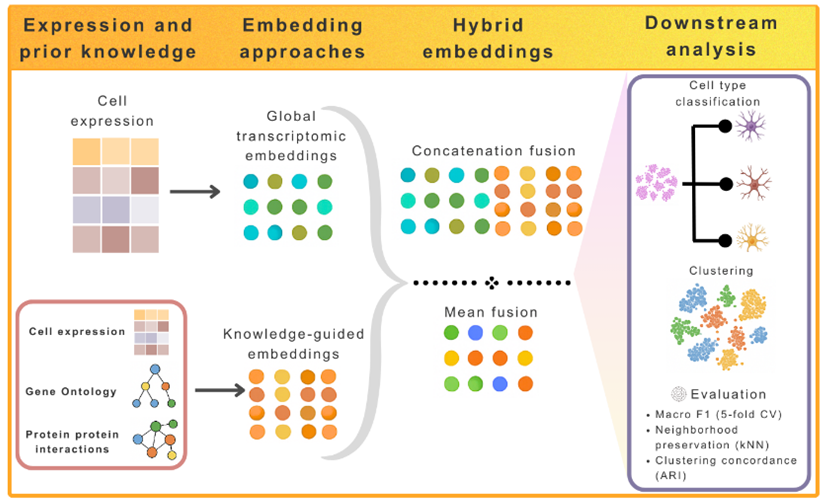
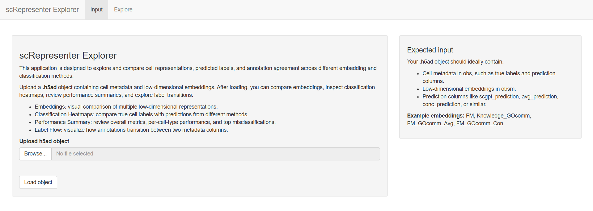
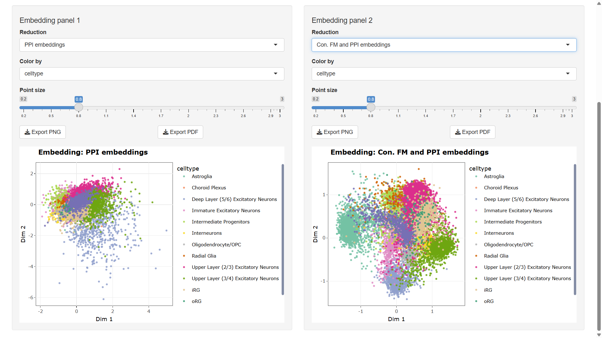

# scRepresenter: a unified framework for computing and benchmarking biologically informed cellular representations in single-cell transcriptional data



In single-cell RNA-sequencing (scRNA-seq) analysis, the quality of cellular embeddings is crucial for accurate downstream biological interpretation. This issue is especially significant in neural tissues, which display a wide diversity of cell types, and in disease contexts characterized by transient cellular states. Foundation models, when applied individually, effectively capture global transcriptomic structures across large-scale datasets. In contrast, biological knowledge–guided approaches use struc-tured priors to enhance interpretability and local coherence. However, despite the complementary ad-vantages of these methods, there is currently no unified framework for their systematic comparison and integration.

To address this gap, we introduce scRepresenter—an open-source, systematic workflow for computing, integrating, and validating multiple cellular embedding strategies within standard single-cell analysis pipelines. scRepresenter supports four categories of embedding representations: (1) expres-sion-based, (2) knowledge-guided, (3) foundation model–derived, and (4) hybrid approaches that com-bine global transcriptomic context with structured biological priors. All strategies are evaluated under harmonized preprocessing and benchmarking conditions to ensure fair and systematic comparison. We benchmarked scRepresenter using data from a neurodegenerative disease model based on human brain organoids—multicellular, patient-specific, lab-grown cortical tissues. Our results show that hybrid embeddings consistently achieve higher macro F1-scores and better structural preservation, especially for rare and transcriptionally similar cell populations. Furthermore, unsupervised analyses revealed en-hanced recovery of reference cell-type structures across a range of clustering resolutions. By enabling transparent comparison and principled integration of complementary embedding paradigms, scRepre-senter provides a robust and systematic approach for interpreting complex single-cell datasets, particu-larly in challenging biological contexts. 


##  Installation

To clone the repository, use the following command:
```
git clone https://github.com/GuilhermePocas/scRepresenter.git
```

It is possible to install the requirements directly to your computer, which requires Python 3.10 and should be done in a separate python environment.
```
python -m venv .venv
source .venv/bin/activate
pip install -r requirements.txt
```

However, due to the large amount of packages this may lead to versioning issues, so one of the following environment is recommended:

### Conda

To install all the requirements in a conda environment, simply run:

```
conda create --name=condaenv python=3.10
conda activate condaenv
pip install -r requirements.txt
```

Make sure you have an [Anaconda Distribution](https://www.anaconda.com/download) installed.

### Docker

We also provide two separate Dockerfiles depending on the availability of GPU capabilities. If one is available, which is highly recommended , run the following commands:

```
docker build -f Dockerfile.gpu -t env .
docker run -it --gpus all --rm -v $(pwd)/output:/app/output env bash
```

If no GPU is available, then use the CPU-based dockerfile by running the following:
```
docker build -f Dockerfile.cpu -t env .
docker run -it --rm -v $(pwd)/output:/app/output env bash
```

##  Usage

### Data preprocessing

In order to get the best performance out of scRepresenter, preprocessing the scRNA dataset is highly recommended. We performed several preprocessing steps, mainly:

- Filtering of low-impact genes;
- Filtering of low-quality cells;
- Normalization;
- Log1p transformation;
- Selection of only the high variance genes;

For an example of a preprocessing pipeline, see the [Preprocessing notebook](https://github.com/GuilhermePocas/scRepresenter/blob/main/scripts/Preprocessing.ipynb).

### Networks

scRepresenter utilizes a gene similarity graph to run the scNET model. Four pre-made graphs can already be found in ``` ./src/networks ``` , constructed from GO annotations, Protein-Protein Interactions and Transcription Factor proteins. To build a custom gene similarity graphs (barring the PPI graph), use the methods found in ``` ./src/networks ```. 

For the GO-based methods, a GO annotations file is required, found in the [GO archive](https://release.geneontology.org/), we recommend the human file, ```goa_human.gaf```, from version 2025-02-06. For the Transcription Factors method, the full interaction table of the [TFLink database](https://tflink.net/download/) was used, specifically the small and large-scale full interaction table for the human organism. Both of these files need to be placed in ``` ./src/networks/knowledge sources ``` to run the corresponding methods, which can be done with the following command:

``` 
python create_METHOD_graph.py --top_p 100 --var_genes 2000
```

With *METHOD* being one of the available network creation methods (GOpairs, GOembs, TFpairs) and with the following arguments:

- **top_p(int)**: the number of pairs to consider for each gene, higher numbers might lead to computationally intensive graphs.

- **var_genes(int)**: the number of highly variable genes to be selected.

### scRepresenter

To run the scRepresenter pipeline, first load a scRNAseq dataset using Scanpy. The pipeline automatically downloads the Human scGPT checkpoint, in order to use another organ checkpoint from https://github.com/bowang-lab/scGPT/tree/main#pretrained-scGPT-checkpoints download it and place it in ```./src/scgpt/checkpoints```. Then, run the following function:

```
scnet_embs, scgpt_embs, avg_embs, conq_embs, labels = run_scRepresenter(model_name, data, network, dir, scnet_epochs, scgpt_epochs)
```

with the following args:

- **model_name(str)**: the name of the current run.

- **data(AnnData)**: a scRNAseq AnnData object.

- **network(str)**: the file path of the gene similarity network.

- **dir(str)**: the output directory where the results and embeddings will be saved.

- **scnet_epochs(int)**: the number of steps when training scNET.

- **scgpt_epochs(int)**: the number of steps when training scGPT.

The resulting output objects are:

- **scnet_embs**: the embeddings from the scNET model.

- **scgpt_embs**: the embeddings from the scGPT model.

- **avg_embs**: the scRepresenter embeddings with the average aggregation strategy.

- **conq_embs**: the scRepresenter embeddings with the concatenation aggregation strategy.

- **labels**: the cell type labels, in the same order as the embeddings.

For a detailed example see the [Model Training notebook](https://github.com/GuilhermePocas/scRepresenter/blob/main/scripts/Model%20Training.ipynb), where scRepresenter is trained on the PBMC3k dataset from Scanpy.

## Embedding analysis

### Output structure 

The scRepresenter pipeline outputs a .h5ad file containing the original expression counts that were used to train the model, as well as the following:

- The scNET embeddings;
- The scGPT embeddings;
- The scRepresenter embeddings, using the average of both models;
- the scRepresenter embeddings, using the concatenation of both models;

These can all be found in the ```.obsm``` attribute of the AnnData object. Additionally, if you have completed the [Classification notebook](https://github.com/GuilhermePocas/scRepresenter/blob/main/scripts/Classification.ipynb), you can also find the corresponding predictions of each embedding in the ```.obs``` layer of the object. 


### Interactive data viewer (Shiny app)

A shiny application is also provided to better analyse the embedding objects produced by scRepresenter, allowing for the exploration of the data and the creation of plots and graphs. It requires R 4.5, and can be run locally.

```
cd app
Rscript packages.R
Rscript app.R
```

Alternatively, it can also be set up in a Docker container by building the docker image from the provided Dockerfile in the ```/app``` directory, and running the container.

```
docker build -t shiny-app .
docker run -p 3838:3838 shiny-app
```

The application can then accessed through ```http://localhost:3838/``` using your internet browser. Any H5 embedding object produced by the pipeline can be uploaded here, and the specific embeddings described in the scRepresenter paper can be found [here](https://drive.google.com/file/d/19NVlnrTCTDOW9tHsVgjekZEyGVTTS1wJ/view?usp=sharing.)



First off, upload the desired .h5ad object, which should be the output of the scRepresenter pipeline. Additionally, in order to compare embeddings, you will need to classify each cell's embedding (see the [Classification notebook](https://github.com/GuilhermePocas/scRepresenter/blob/main/scripts/Classification.ipynb)). After pressing the "Load Object" button you will see a short summary of the object's available embeddings, as well as its metada columns.



After loading the object, you can go over to the "Explore" tab, where you can observe several features of the object. After selecting some global settings you can choose from several graphs and plots, such as the UMAP plots pictured above.

## Tutorial notebooks

For usage examples, see the following notebooks:

- [Preprocessing](https://github.com/GuilhermePocas/scRepresenter/blob/main/scripts/Preprocessing.ipynb)
- [Model Training](https://github.com/GuilhermePocas/scRepresenter/blob/main/scripts/Model%20Training.ipynb)
- [Classification](https://github.com/GuilhermePocas/scRepresenter/blob/main/scripts/Classification.ipynb)
- [Embedding Analysis](https://github.com/GuilhermePocas/scRepresenter/blob/main/scripts/Embedding%20Analysis.ipynb)